---
title:
    Nagoya port and aquarium
---

Today we went out in a small group to visit the [Port of Nagoya Public
Aquarium](https://nagoyaaqua.jp/english/). It took us about an hour to get
there by riding the bus to Fujigaoka station, then taking the Meitetsu line
towards Sakae station and finally changing to the Meijou and Meikou metro
lines.

<figure style="display: inline-block; width: 500px; text-align: center;">
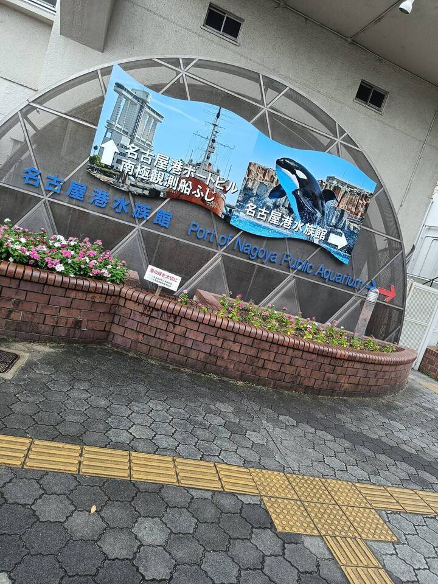
</figure>
<figure style="display: inline-block; width: 500px; text-align: center;">
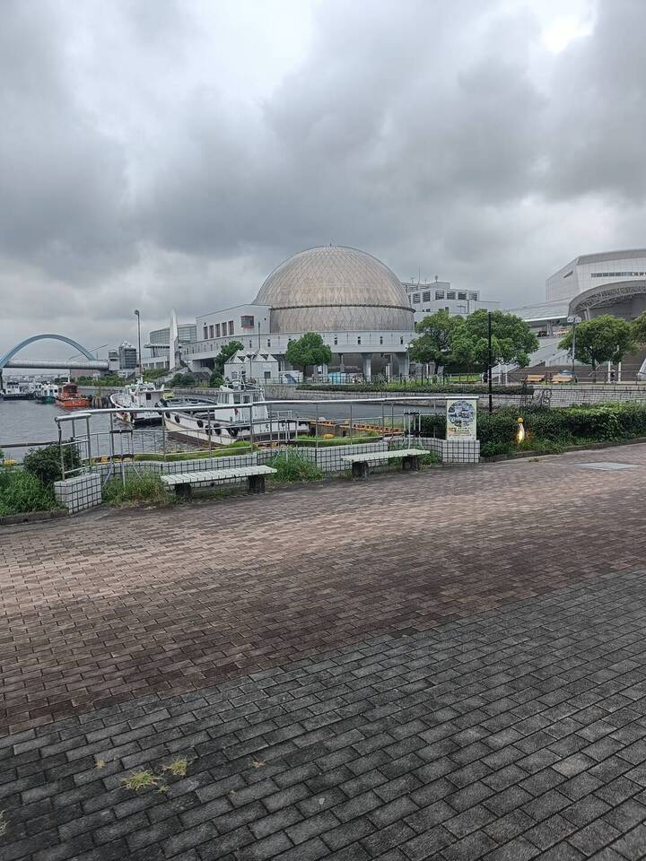
</figure>

## The aquarium

The aquarium itself was pretty nice, they had everything from dolphins and
turtles to large swarms of fish, crabs and penguins. The entrance fee was
around 1500 yen which I think is really fair. I of course spent a bit more on
buying drinks at each vending machine on the way. We strolled around for about
two hours. There's not much more to say here, just enjoy the maritime life.

<figure style="display: inline-block; width: 500px; text-align: center;">
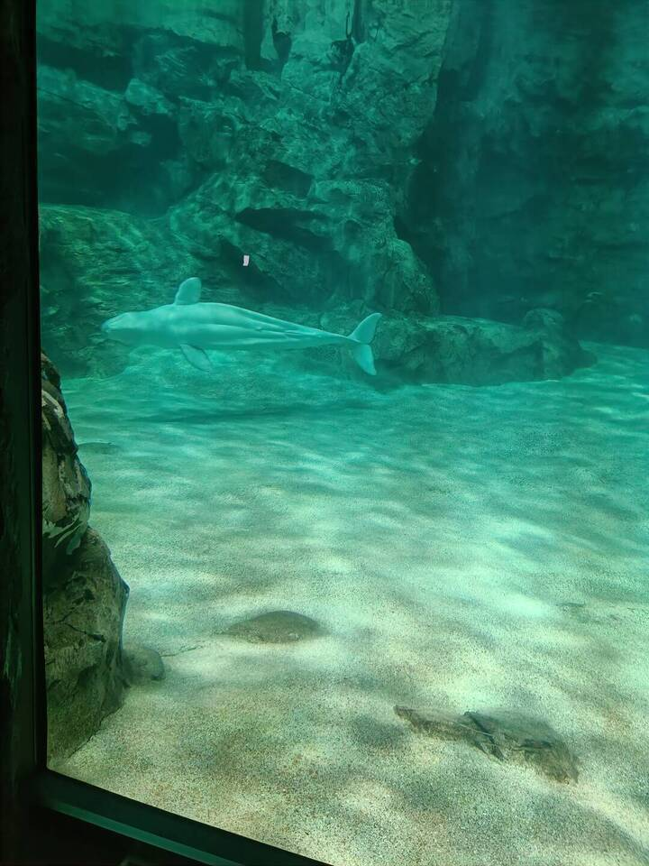
</figure>
<figure style="display: inline-block; width: 500px; text-align: center;">
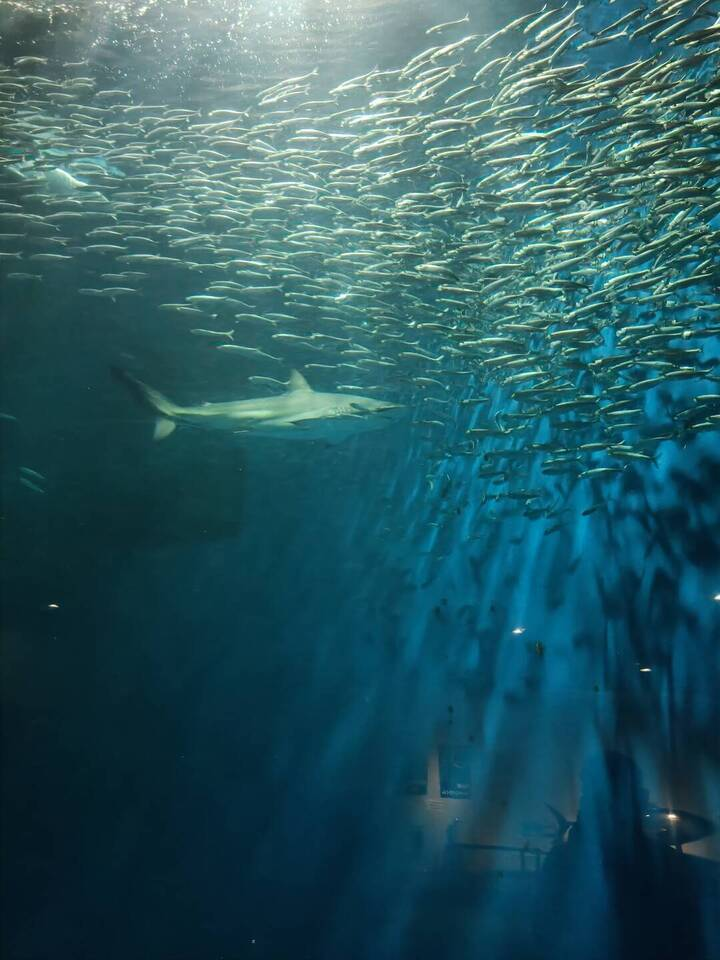
</figure>
<figure style="display: inline-block; width: 500px; text-align: center;">
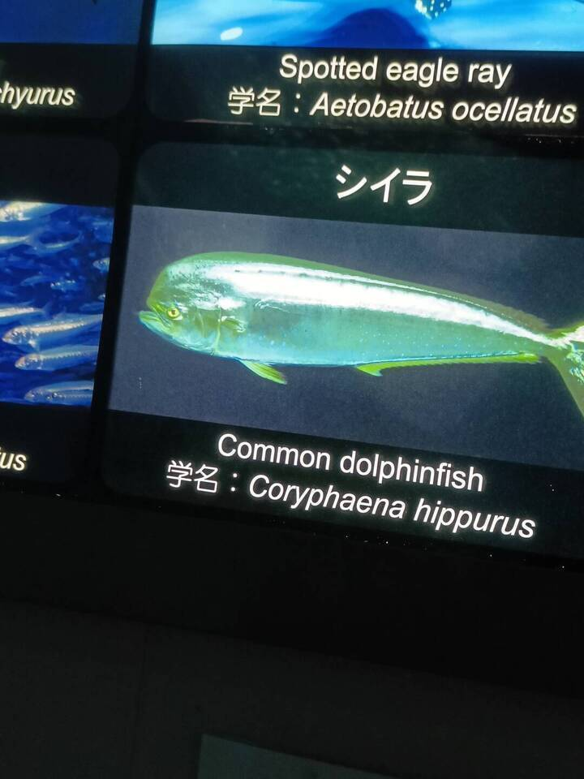
</figure>
<figure style="display: inline-block; width: 500px; text-align: center;">
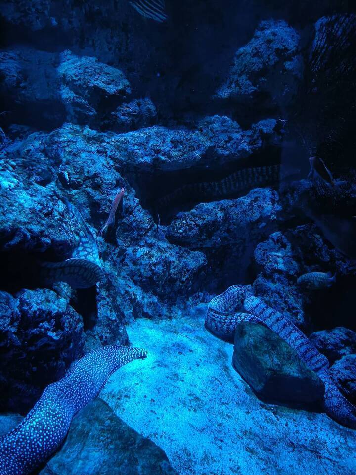
</figure>
<figure style="display: inline-block; width: 500px; text-align: center;">
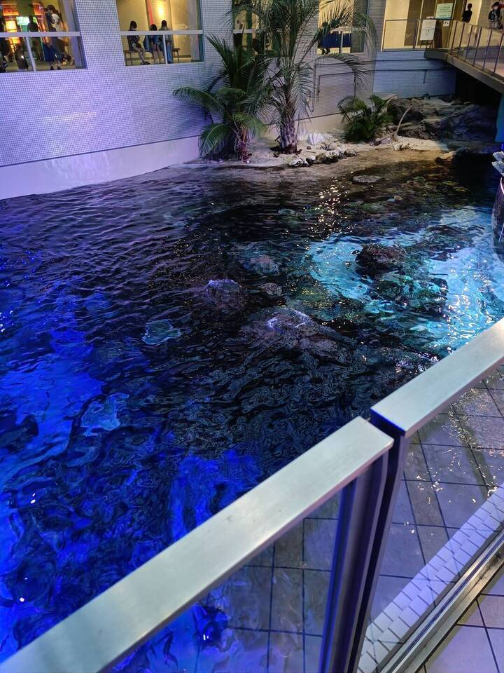
</figure>
<figure style="display: inline-block; width: 500px; text-align: center;">
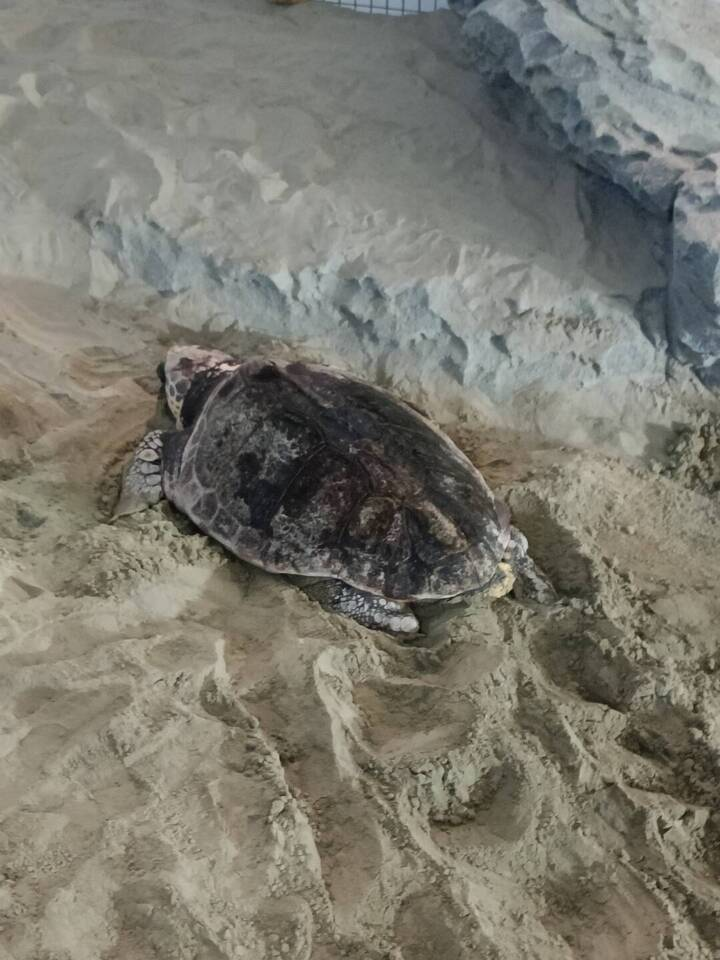
</figure>
<figure style="display: inline-block; width: 500px; text-align: center;">
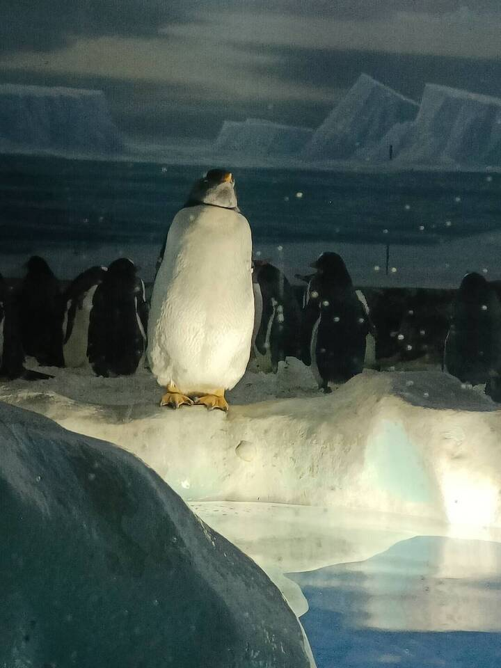
<figcaption>
I see no god up here except me
</figcaption>
</figure>
<figure style="display: inline-block; width: 500px; text-align: center;">

<figcaption>
Chonk
</figcaption>
</figure>

## 観覧車

After visiting the aquarium, we noticed a large ferris wheel nearby. It is
apparently a part of the [Sea Train
Land](https://www.aichi-now.jp/en/spots/detail/99/) amusement park which we
promptly visited. The ferris wheel ride took 20 minutes and cost 700 yen and
was absolutely worth it. As it was already dark, we could see the night lights
of Nagoya and the ships cruising around the port which was gorgeous - my
shitty phone camera can't do it justice.

<figure style="display: inline-block; width: 500px; text-align: center;">
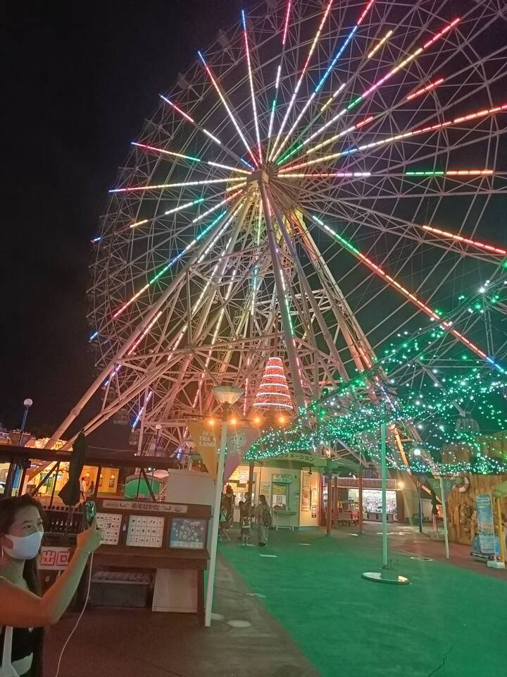
</figure>
<figure style="display: inline-block; width: 500px; text-align: center;">
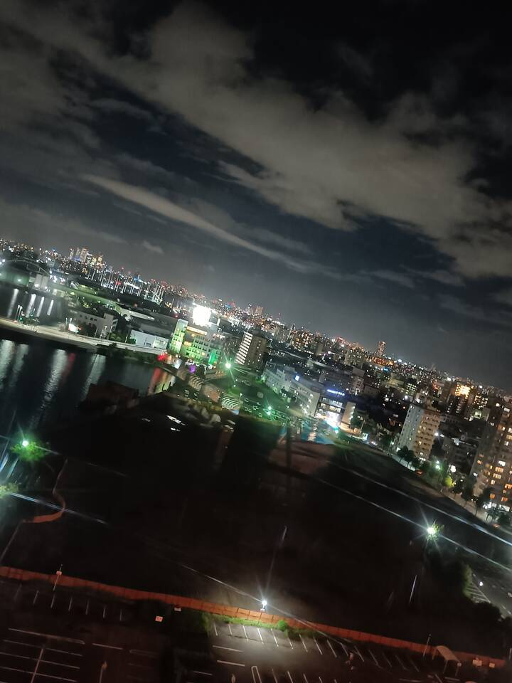
</figure>
<figure style="display: inline-block; width: 500px; text-align: center;">
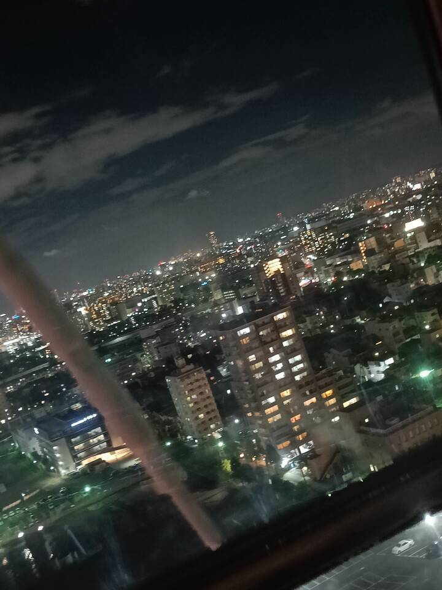
</figure>
<figure style="display: inline-block; width: 500px; text-align: center;">
<video autoplay muted loop style="width: 100%; margin: 1rem auto;">
    <source src="../res/ferris.webm" type="video/webm">
</video>
<figcaption>
Why ffmpeg give black bars 😭
</figcaption>
</figure>

## Eating out

Afterwards, we went to a *fine dining establishment* - an Indian restaurant.
Ordering was kinda weird because the Indian guy spoke Hindi and Japanese while
some of us ordered in English. We all managed to get what we wanted and had a
good time. I had seafood biryani and some weird mango cocktail which tasted
great though. Some time later and after some payment struggles (we couldn't
split the bill so we had to collect the exact amount from everybody) we traveled
back to Fujigaoka station to take the last bus back to the dorm. Overall an
8/10 experience, would do it again.

<figure style="display: inline-block; width: 500px; text-align: center;">

<figcaption>
Ahh yes, Japanese cuisine
</figcaption>
</figure>
<figure style="display: inline-block; width: 500px; text-align: center;">
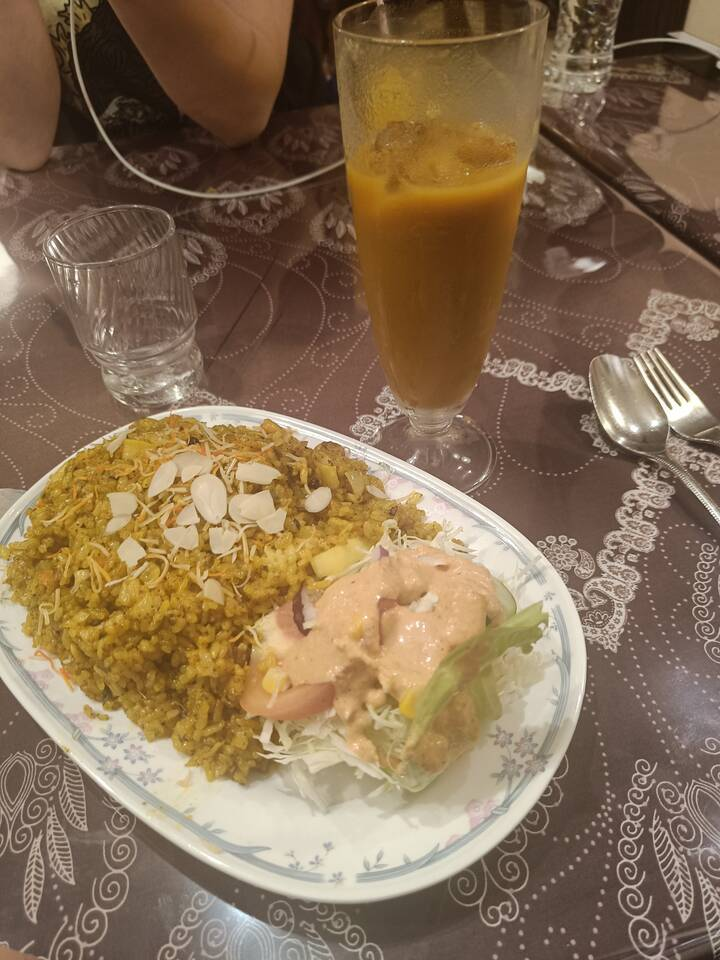
<figcaption>
Lots of food
</figcaption>
</figure>

