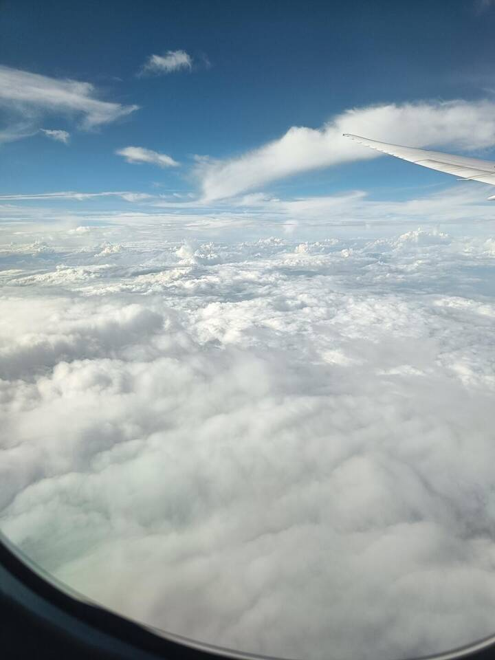
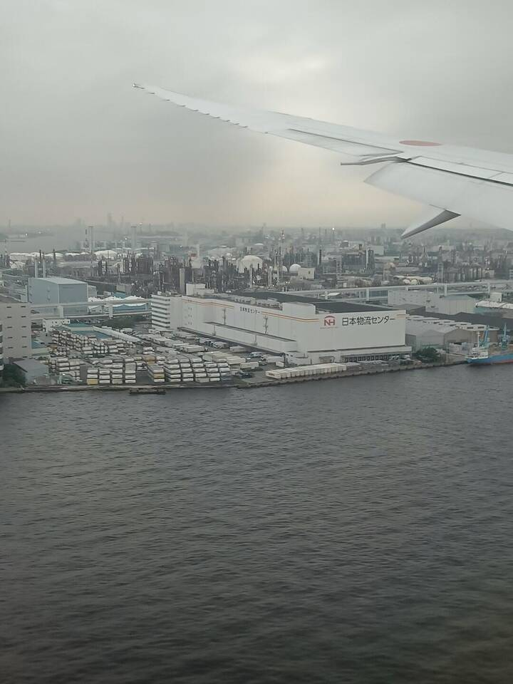
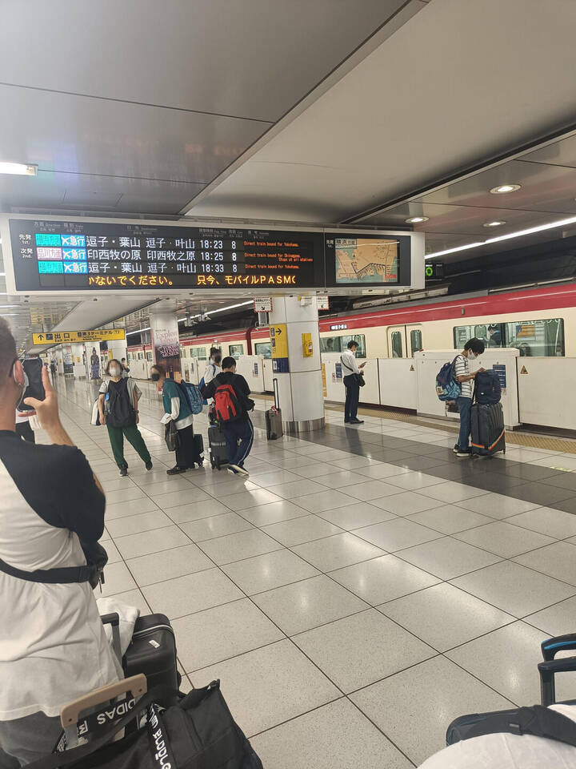

---
title:
    Arrival
---

More often than not, plans we make go down the drain. This is basically what
happened to my arranged travel route from Germany to Nagoya. But as with all
bad things, they can have upsides too.

## The plan

The basic plan was really simple. I was supposed to travel to Frankfurt
airport, then take a flight to Toukyou and then a connecting flight to Nagoya.
From there, a bus were to pick us up to our dorm. Really simple, eh?

We actually managed to get to Frankfurt without problems and with time to
spare. We checked in, received our boarding pass and passed security. The plane
boarding went smooth and we had an undisturbed (albeit very uncomfortable and
sleepless) flight to Toukyou. This is where all went wrong.

See, we were supposed to arrive in Toukyou at around 16:45 with the connecting
plane to Nagoya departing at 18:05. This seemed too short from the beginning,
but our travel agency (as well as the airline) assured us it'd be plenty of
time.

<figure style="display: inline-block; width: 500px; text-align: center;">

<figcaption>
Kinda cloudy
</figcaption>
</figure>
<figure style="display: inline-block; width: 500px; text-align: center;">

<figcaption>
Much industry
</figcaption>
</figure>

## Reality

Well, it was not. First off, there were lots of border measures in place. The
whole airport was divided into fixed lanes with staff and police officers
showing us the way at each corner. The quarantine station went pretty smoothly
as we were able to show our blue MySOS screen and get past in a few minutes.
After this initial success, we got stuck at immigration. I thought the passport
with the visa and the QR codes from VisitJapanWeb were enough, but the
immigration officer wanted to see our Certificate of Eligibility.

Usually, this gets sent to you by the partner university, but due to restricted
postal air service, I didn't receive it. I fortunately managed to explain the
situation to the attendant in a mixture of broken Japanese and English and
received my residence card nonetheless.

Because of the delay at immigration, we missed our connecting flight. We were
not the only ones though as a whole group of 9 students was supposed to take
this flight. The airline staff kindly explained the situation, gave us 11.000
Yen (~80 EUR) and told us to use the train.

## Plan B

You can probably imagine how a group of 9 students with only basic Japanese
skills responded to the "just take the train" answer. We of course accepted the
challenge and made our way to the first stop - Shinagawa station.

Buying a paper ticket was really easy since the staff helped us. We then
boarded a train we thought headed towards Shinagawa station. In hindsight, it
probably *did* went to Shinagawa station, but we were somehow convinced we were
wrong and got off only a few stops later, at Ooita. We then looked for a map
and asked the passengers in every passing train whether it was going to
Shinagawa. Once we found one that did, we finally managed to get to Shinagawa
station.

<figure style="display: inline-block; width: 500px; text-align: center;">

<figcaption>
Easy to find
</figcaption>
</figure>
<figure style="display: inline-block; width: 500px; text-align: center;">

<figcaption>
Not that busy
</figcaption>
</figure>

We then walked around cluelessly looking for any signs of a Shinkansen which
was supposed to take us to Nagoya. After asking around, staff attendants guided
us to the ticket office where we bought our tickets. I probably didn't speak
clearly enough because I was given one with a fixed train which was departing a
few minutes from thereon without knowing anything about the station and
platforms.

Fortunately, Shinagawa station is pretty well designed, so we found the platform
almost immediately and managed to board the Nozomi Shinkansen towards
Oosaka/Nagoya with 3 minutes to spare. After 90 minutes, we arrived at Nagoya
station where we took the Higashiyama line towards Takenoyama station. A final
bus ride and short walk brought us to our dorm where we took a shower and went
to sleep almost immediately.

## Conclusion

Although missing the plane entailed additional time and effort, it was fun to
get to use Toukyou's public transportation system and the Shinkansen ride was
really relaxing, but unfortunately it was dark already so there wasn't much
scenery to enjoy. We also got to know each other as a group. Overall, the extra
turmoil was well worth it.
