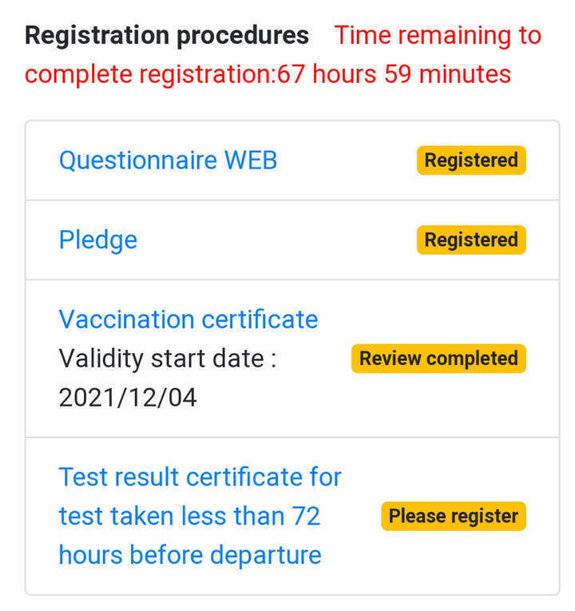
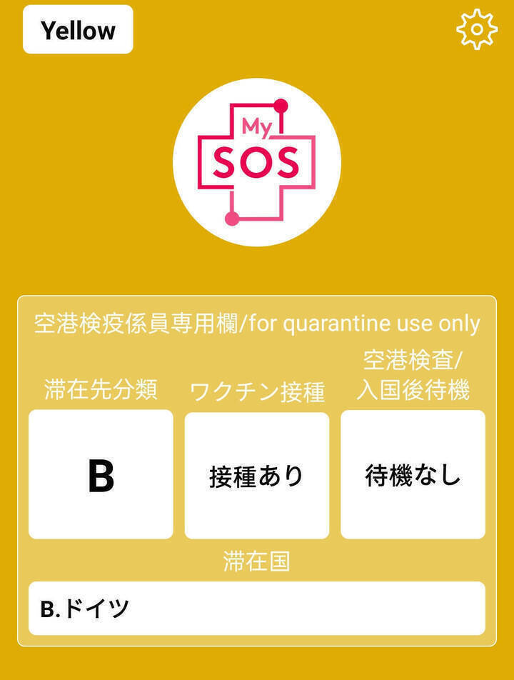

---
title:
    2022 Japan Blog
---

I will be spending autumn and winter 2022 in
[Japan](https://www.youtube.com/watch?v=_mkiGMtbrPM) as an exchange student,
namely in [Nagoya](https://goo.gl/maps/5d5kyaWS4CZaL1t56) at the [NUFS (Nagoya
University of Foreign Studies)](https://www.nufs.ac.jp/). Arrival is on August
24th and departure is planned for December 23rd, so four months in total.

## Timeline Index

The current plan is to ~~shove everything which does not deserve a whole new
page into this document~~ put some stuff on this page and some on dedicated
ones, meaning a time-based index becomes necessary. Please enjoy easiness of
navigation made possible through the power of hypertext.

### Post-departure (**bold** text indicates a dedicated page)

- [**2022-08-26**](./2022_japan_ftd.html): The first two days

### Pre-departure (**bold** text indicates a dedicated page)

- [**2022-08-24**](./2022_japan_arrival.html): We arrived! (with lots of trouble)
- [2022-08-21](./2022_japan_blog.html#final-preparations): Final preparations
- [2022-08-20](./2022_japan_blog.html#mysos): MySOS, FastTrack and immigration
- [2022-07-20](./2022_japan_blog.html#visa-received): Visa received
- 2022-07-04: Visa application submitted to Japanese consulate in Frankfurt
- 2022-06-13: Contact with exam office, filling out learning agreement
- [2022-05-30](./2022_japan_blog.html#flight-booking): Flight booked
- 2022-05-18: Accepted by NUFS, received acceptance letter
- 2022-03-07: Confirmation by NUFS
- 2022-03-03: Application documents sent to NUFS
- 2022-02-15: Nominated at NUFS
- 2022-01-24: Application confirmed and accepted by international office
- [2021-11-23](./2022_japan_blog.html#mobility-online): Application uploaded to Mobility-Online
- 2021-10-26: Registration on Mobility-Online application website
- 2021-04-12: Meeting with international office to discuss concrete questions
- 2021-01-11: First contact with international office, basic information and dates
- [2020-12-23](./2022_japan_blog.html#first-contact): First contact with faculty, basic information
- 2020-07-20: Enrolment at university

## Final preparations

Oh lord, two more days to go! Although receiving the visa was the last major
step regarding organization, there was still a lot of preparation to be done.

Probably the most important thing to consider is how to get to that sweet sweet
money you need for your daily expenses. Japan is still a cash-based society so
you need to be able to withdraw cash. Fortunately, every 7-11 convenience store
has an ATM run by SevenBank which you can use to withdraw cash. I only had a
debit card until this point so I went to my bank and asked them for a credit
card. I also learned that my debit card is *Maestro*-capable which means I can
use it globally as a MasterCard. I now have two cards which should both work,
but I'm probably gonna use my Maestro card since the MasterCard has horrendous
fees of like 5%.

I also bought some new electronics in the form of a tablet and noise-cancelling
headphones to use on the flight. In addition, I will bring my old headphones as
a backup in case something goes wrong as I can't live without music.

I will also bring my laptop of course and try to kill some time doing
programming challenges or learning new stuff. I'm also gonna make use of the
nice [torrent helper](https://github.com/Baseng0815/nyaahelper) I've written a
couple of days ago to download an ungodly amount of anime. Thirteen hours is
not **that** terrible, but I guess having something to do is still nice.

Aside from money and electronics, I also bought daily necessities like new
clothing, shampoo and toothpaste. A new suitcase was also necessary. The
airline limits total weight to 23kg and inner dimensions to something like
158cm, so be careful to not exceed this limit. I'm planning to pack lightly
anyway as I'll be doing laundry each week and want to take lots of stuff from
Japan back home!

## MySOS

Japan at the current point of time is still closed to foreign tourism due to
the ongoing pandemic. Fortunately, it reopened a few months ago to
international students which was great news for me! Despite reopening the
borders, there are still lots of strict measures in place which basically means
you need to do a shit ton of stuff to be able to enter.

First of all, you need to be tested negatively for Covid at most 72h before the
flight. I depart on tuesday which means I need to get tested on monday. The
Japanese government has given out a
[form](https://www.mhlw.go.jp/content/000799426.pdf) which needs to be filled
out by the testing institution to confirm stuff like exact testing method used
and so on. You also need a Covid vaccination certificate which most people
probably already have. In my case, a scan of the EU one was enough.

Although these documents can be submitted in paper-form at the arrival
airport, it could take some time for the staff to confirm so there are
pre-departure processes in place, namely Fast Track and Visit Japan Web.
Fast Track works downloading the MySOS app and completing four steps:

1. Questionnaire
2. Pledge
3. Covid vaccination certificate
4. Negative covid test

I have completed the first three steps and they were already positively
confirmed by the app. The app background currently is yellow, but it's supposed
to turn green once I submit my negative covid test. I am then able to show the
green screen to staff at the airport without any additional questioning.

<figure style="display: inline-block; width: 500px; text-align: center;">

<figcaption>Still need to submit the test</figcaption>
</figure>
<figure style="display: inline-block; width: 500px; text-align: center;">

<figcaption>App summary</figcaption>
</figure>

MySOS was working fairly well for a government-issued app, but it still
suffered from long loading times which took place in the foreground, blocking
off all other activity. And while the app itself could be set to English, the
sites it redirected to stayed in Japanese, at least for me. I still managed to
figure everything out somehow, but other people might have been in trouble. So
much for app design, but it works, so eh.

Visit Japan Web basically needs the same information, but is used to
preregister for immigration procedures instead. It can also be used to declare
customs, but that doesn't apply to me. I've yet to fill it out, but it'll
hopefully be just as smooth as the Fast Track experience.

## Visa received

If you want to stay for more than 90 days in Japan you need a visa, in my case
the *General Visa: Student*. Once I received all necessary documents, I
immediately filled out the [visa application
form](https://www.mofa.go.jp/j_info/visit/visa/pdfs/application1.pdf) and took
the first train on the next day to the Japanese consulate in Frankfurt. I
missed it at first because it is located in the 34th floor of the Messe Turm,
but the reception staff kindly showed me the way. After a short security check,
I submitted all documents to the staff - and was told the back side of the CoE
was missing. I was confused at first because I didn't receive any more
documents, but after sending a mail to NUFS and explaining the situation (which
surprised them too by the way), they sent the back side as well which allowed
me to finally submit my application.

I needed to submit the following documents:

- Certificate of Eligibility (CoE; only a copy as express air mail wasn't
  available at the time)
- Fast Track Confirmation (to handle quarantine procedures due to the ongoing
  Covid pandemic)
- Passport (original and copy)
- Visa application form

A few days after submission I noticed a mistake from my side. I had stated
Centrair as the port of entry as I assumed I would only land in Haneda for
transit and wouldn't pass through immigration, which apparently was wrong. After
panicking, I sent a mail to the consulate explaining the situation and they
told me everything is fine and I can just correct it when picking up the visa
which I finally did.

Picking the visa up was easy as I just had to show them my personal ID card and
after around half an hour I received my passport back and the process was
finished!

## Flight Booking

You should probably book your flight later than I did, at least if Covid is
still a thing. The visa only allows you to enter Japan on one predetermined day
and if rules change and you need to quarantine you have to reschedule your
flight or book a new one which could potentially become very expensive. The
booking process itself was really easy, I just called a travel agency and they
made an offer. I paid around 1200 Euros for a round trip ticket with a direct
connection from Frankfurt to Tōkyō and Tōkyō to Nagoya and a total flight time
of around 15 hours, not including transit.

## Mobility-Online

Mobility-Online is the online application tool aiding you in your application
process. There are lots of steps necessary to complete the application which
are nicely summarized by Mobility-Online. You submit your documents there and
wait for the international office to accept them and redirect your application
to the partner university.

Mobility-Online is great, but is only the first part of the application
process. After you're nominated at the partner university, they require tons of
documents as well which I managed to submit through a lively mail exchange.

## First contact

You should reach out to the international office as soon as possible and
clearly communicate what you want to do. Knowing early what you need to submit
and when you need to submit it and already knowing the people working there
helps greatly.

You probably want to spend some time researching your potential partner
universities and reducing the number of candidates. Choosing to begin
organizing your semester abroad early will also help to keep your mind at ease
knowing exactly what needs to be done next and when you need to finish it. In
my case, I spent the months between the first contact and submission of my
application to take a look at the programs offered by university candidates and
comparing things like the living situation and extracurricular activities. More
often than not you need a large enough time buffer to acquire certain
documents, e.g. an English language certification.

You also shouldn't refrain from contacting people when you're stuck or have
questions. After all, organization lies in your hands and demands a certain
level of initiative.
