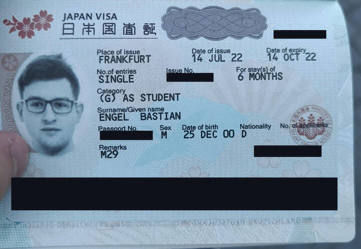

---
title:
    2022 Japan Blog
---

I will be spending autumn and winter 2022 in
[Japan](https://www.youtube.com/watch?v=_mkiGMtbrPM) an an exchange student,
namely in [Nagoya](https://goo.gl/maps/5d5kyaWS4CZaL1t56) at the [NUFS (Nagoya
University of Foreign Studies)](https://www.nufs.ac.jp/). Arrival is on August
24th and departure is planned for December 23rd, so four months in total.

## Timeline Index

The current plan is to shove everything which does not deserve a whole new page
into this document, meaning a time-based index becomes necessary. Please enjoy
easiness of navigation made possible through the power of hypertext.

- [2022-07-20](./2022_japan_blog.html#visa-received): Visa received
- 2022-07-04: Visa application submitted to Japanese consulate in Frankfurt
- 2022-06-13: Contact with exam office, filling out learning agreement
- [2022-05-30](./2022_japan_blog.html#flight-booking): Flight booked
- 2022-05-18: Accepted by NUFS, received acceptance letter
- 2022-03-07: Confirmation by NUFS
- 2022-03-03: Application documents sent to NUFS
- 2022-02-15: Nominated at NUFS
- 2022-01-24: Application confirmed and accepted by international office
- [2021-11-23](./2022_japan_blog.html#mobility-online): Application uploaded to Mobility-Online
- 2021-10-26: Registration on Mobility-Online application website
- 2021-04-12: Meeting with international office to discuss concrete questions
- 2021-01-11: First contact with international office, basic information and dates
- [2020-12-23](./2022_japan_blog.html#first-contact): First contact with faculty, basic information
- 2020-07-20: Enrolment at university

## Visa received

If you want to stay for more than 90 days in Japan you need a visa, in my case
the *General Visa: Student*. Once I received all necessary documents, I
immediately filled out the [visa application
form](https://www.mofa.go.jp/j_info/visit/visa/pdfs/application1.pdf) and took
the first train on the next day to the Japanese consulate in Frankfurt. I
missed it at first because it is located in the 34th floor of the Messe Turm,
but the reception staff kindly showed me the way. After a short security check,
I submitted all documents to the staff - and was told the back side of the CoE
was missing. I was confused at first because I didn't receive any more
documents, but after sending a mail to NUFS and explaining the situation (which
surprised them too by the way), they sent the back side as well which allowed
me to finally submit my application.

I needed to submit the following documents:

- Certificate of Eligibility (CoE; only a copy as express air mail wasn't
  available at the time)
- Fast Track Confirmation (to handle quarantine procedures due to the ongoing
  Covid pandemic)
- Passport (original and copy)
- Visa application form

A few days after submission I noticed a mistake from my side. I had stated
Centrair as the port of entry as I assumed I would only land in Haneda for
transit and wouldn't pass through immigration, which apparently was wrong. After
panicking, I sent a mail to the consulate explaining the situation and they
told me everything is fine and I can just correct it when picking up the visa
which I finally did.

Picking the visa up was easy as I just had to show them my personal ID card and
after around half an hour I received my passport back and the process was
finished!

## Flight Booking

You should probably book your flight later than I did, at least if Covid is
still a thing. The visa only allows you to enter Japan on one predetermined day
and if rules change and you need to quarantine you have to reschedule your
flight or book a new one which could potentially become very expensive. The
booking process itself was really easy, I just called a travel agency and they
made an offer. I paid around 1200 Euros for a round trip ticket with a direct
connection from Frankfurt to Tōkyō and Tōkyō to Nagoya and a total flight time
of around 15 hours, not including transit.

## Mobility-Online

Mobility-Online is the online application tool aiding you in your application
process. There are lots of steps necessary to complete the application which
are nicely summarized by Mobility-Online. You submit your documents there and
wait for the international office to accept them and redirect your application
to the partner university.

Mobility-Online is great, but is only the first part of the application
process. After you're nominated at the partner university, they require tons of
documents as well which I managed to submit through a lively mail exchange.

## First contact

You should reach out to the international office as soon as possible and
clearly communicate what you want to do. Knowing early what you need to submit
and when you need to submit it and already knowing the people working there
helps greatly.

You probably want to spend some time researching your potential partner
universities and reducing the number of candidates. Choosing to begin
organizing your semester abroad early will also help to keep your mind at ease
knowing exactly what needs to be done next and when you need to finish it. In
my case, I spent the months between the first contact and submission of my
application to take a look at the programs offered by university candidates and
comparing things like the living situation and extracurricular activities. More
often than not you need a large enough time buffer to acquire certain
documents, e.g. an English language certification.

You also shouldn't refrain from contacting people when you're stuck or have
questions. After all, organization lies in your hands and demands a certain
level of initiative.
