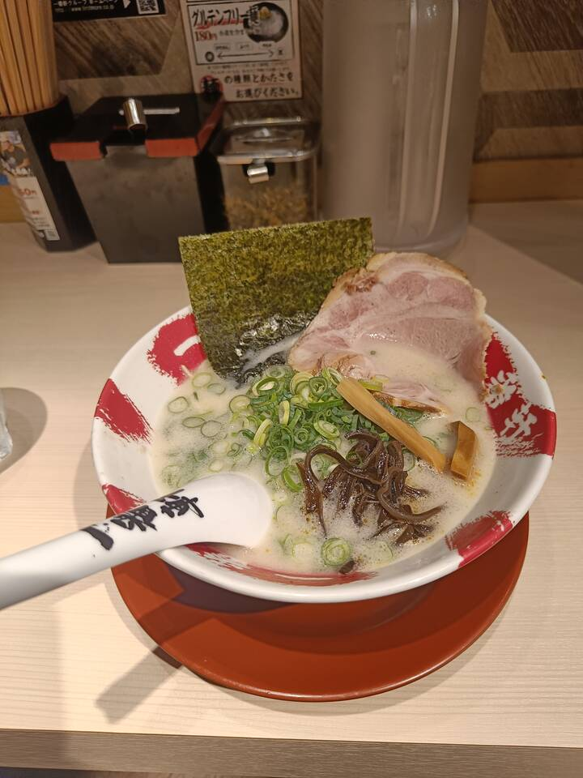

---
title:
    Nagoya tour
---

We went on a tour around Nagoya today. Leaving the dorm in the early morning
hours of 10am, we drove in a small group of people by car to the nearest train
station and took the train towards Nagoya station. We then switched to the
Meijou metro line and arrived at Nagoya castle by 11am.

## Nagoya castle

Nagoya castle is a historically important place and popular sightseeing spot.
I'm not even gonna attempt any historical explanations as I know next to
nothing about Japanese history, but I bet some really important people lived
there and did some really important stuff. We visited some buildings, walked
around the outside and relaxed afterwards at the nearest vending machine.

<figure>
<figcaption>Lots of greenery</figcaption></figure>
<figure>
<figcaption>Who dis?</figcaption></figure>
<figure>
<figcaption>The main tower was closed unfortunately</figcaption></figure>
<figure>
<figcaption>The walls looked like they were about to crumble</figcaption></figure>
<figure>
<figcaption>I'm no interior designer, but this looks expensive</figcaption></figure>
<figure></figure>
<figure>
<figcaption>Of course Ibaraki has a huge-ass [girls and panzer](https://www.youtube.com/watch?v=03BPG9daepE) banner 💀</figure>
<figure>
<figcaption>Lunch 👍</figcaption></figure>

It was really fun to see the castle up close and walk the same paths the old
rulers used to walk. There was a small festival going on with people singing
and prefectures advertising themselves. We got some snacks there, but went to
our next stop pretty quickly as it was reeeeally starting to become
unpleasantly hot as time crept towards noon, humidity was still high and there
wasn't much shade around.

## Meieki campus

Our next stop was NUFS Meieki campus which was located in central Nagoya. I
didn't know a campus outside Nisshin existed, but it was huge and apparently
some form of research/graduate institute. No wonder why exchange student
plebeians like me had no clue.

There's not much to say about the campus itself, a 20-minute walk from Nagoya
station got us there and because it was really hot outside and the building was
properly AC'd, we spent some time there exploring the floor and chilling in the
lounge. This coincidentally was my first time walking around central Nagoya,
and even though we didn't visit any famous places, I was still astonished by
all the buildings, people and infrastructure which made Frankfurt seem like
some small third-grade town. Unlike other major cities though, there weren't
that many cars around and there was no honking at all.

<figure>
<figcaption>JR central towers, right across Nagoya station</figcaption></figure>
<figure>
<figcaption>Meieki campus main floor (I think? The others were closed)</figcaption></figure>
<figure>
<figcaption>Quite a nice view</figcaption></figure>
<figure><iframe style="height: 600px;" src="https://www.youtube.com/embed/xgYxnON1qLg" title="YouTube video player"
frameborder="0" allow="accelerometer; autoplay; clipboard-write; encrypted-media;
gyroscope; picture-in-picture" allowfullscreen></iframe></figure>

## AEON MALL

After our little break, we went to a nearby shopping mall and visited a book
and an arcade section. The book section was spanning two floors and had a
gargantuan shelf across the staircase which appeared even bigger through a
ceiling mirror. There was a huge selection, but we of course went to the manga
section and found lots of shows we've watched or read before. I wanted to buy
something too of course so I got myself the first four volumes of chainsaw man
which is supposed to be really good. I haven't read it yet, but each volume was
only 440yen which amounts to like 3 Euros. Pretty cheap.

<figure>
<figcaption>Ahh yes, <b>Culture</b></figcaption></figure>
<figure>
<figcaption>Please ignore the \"don't take a picture\"-signs (the picture is not mine anyway)</figcaption></figure>

Next, we went to the small game hall which was on the top floor of the
building. They had a table tennis table and because I haven't played for a
couple of weeks and my fingers were aching already, we played for around 10
minutes which was really fun. There were also crane games which I have never
tried before, but I still managed to somehow win a minecraft steve plushie at
the second try. Because it was too large to carry in my backpack, I was offered
a see-through plastic bag by the staff. While walking through the city with it,
some kids pointed at it and shouted 「STEVE！」. I'm glad there are still
people appreciating the objectively best game ever made.

## Weeb store

Our final stop was an anime/manga store. They had lots of stuff across three
floors which we explored one after another. I was wondering why there were so
many women in the first floor, but after I saw the BL section in the back, it
kinda made sense. I bought a small yotsuba keychain because best girl was not
available at the time, but I'll definitely come back some time and they better
have her in stock by then 🔪.

<figure>
<figcaption>Any Overlord fans?</figcaption></figure>
<figure>
<figcaption>\"That's it, you're going up the Chizuru stairs\"</figcaption></figure>

The whole tour took roundabout eight hours, so I was really tired when we got
back home. It was a good experience though and I will definitely come back to
some of the stores and to find new ones too!
