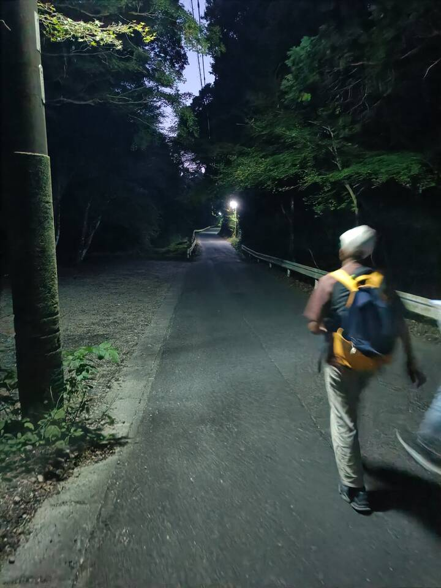

---
title:
    Sanageyama
---

Sanageyama is a mountain located near Toyota city with famous hiking trails. We
really wanted to walk through the countryside and experience Japan's nature, so
we decided to go there.

## Arriving at Sanageyama

 It's a bit cumbersome to get there as you have to ride buses and walk quite a
 bit through small villages, but these things made it even more fun for us as
 we were able to see exciting things like rice paddies or old *oji-san*
 working the fields.

<figure>
<figcaption>Taking the Linimo and then another train, we ended up in the countryside</figcaption></figure>
<figure>
<figcaption>There should be a bus station around somewhere...</figcaption></figure>
<figure>
<figcaption>Well, that looks shady</figcaption></figure>
<figure>
<figcaption>Run-down shops everywhere, a strong contrast to the city</figcaption></figure>
<figure>
<figcaption>More walking after taking the bus</figcaption></figure>
<figure>
<figcaption>And more</figcaption></figure>
<figure>
<figcaption>Finally found the Torii gate that leads up the mountain</figcaption></figure>
<figure>
<figcaption>Fortunately we didn't encounter any bears, only wild bees</figcaption></figure>

## The climb

After we passed through the gate, we were confronted with a split in the road.
We could either go right and take a long, 4-hour trail up or go left and climb
the same height in just over one hour. Because we messed up earlier and got off
at the wrong station, it was already noon so we decided to go for the quick way
up. As it turns out, this was only meant as a shortcut **down** and **not** as
a way up, so it was incredibly steep and exhausting to climb, albeit very fun.

<figure>
<figcaption>Beautiful nature</figcaption></figure>
<figure>
<figcaption>The not-so-beautiful trail</figcaption></figure>
<figure>
<figcaption>At least the stairs were pretty solid</figcaption></figure>
<figure>
<figcaption>Except the areas where there were no stairs</figcaption></figure>
<figure>
<figcaption>Lots of small bridges too</figcaption></figure>
<figure>
<figcaption>It got steeper</figcaption></figure>
<figure>
<figcaption>Almost halfway done</figcaption></figure>
<figure>
<figcaption>We took a five minute break here</figcaption></figure>

We took a longer break at a small observation platform from which we were able
to take a first glance at the landscape and realize the height we've gained so
far.

<figure>
<figcaption>Still steep</figcaption></figure>
<figure>
<figcaption>Fortunately it didn't rain</figcaption></figure>
<figure>
<figcaption>The view was worth it</figcaption></figure>
<figure>
<figcaption>You better not trip, there was no railing and it went straight down</figcaption></figure>

The second part of the climb wasn't as bad fortunately. We came across a small
temple where we were overtaken by some 70 year old dude with legs as thick as
tree trunks, presumably training for iron man or something. I don't know.

<figure>
<figcaption>Not as bad</figcaption></figure>
<figure>
<figcaption>A natural toilet</figcaption></figure>
<figure>
<figcaption>Stairs to the temple</figcaption></figure>
<figure>
<figcaption>Must be a PITA to go up here every day</figcaption></figure>

## Summit and departure

We reached the summit in the afternoon at around 4:00 and met some Japanese guy
who lived nearby and after talking to him for a while, he ran back down as if
the trail was flat ground with no obstacles. It was also colder than I
expected, so after taking a 30 minute break and eating our lunch, we noticed
the sun starting to set and made our way down as fast as possible. We just managed
to get down in time as it was already pitch-black when we passed through the
Torii gate.

<figure>
<figcaption>The peak of 猿投山 at 629m</figcaption></figure>
<figure>
<figcaption>The view from here was also gorgeous and we felt like we really accomplished something</figcaption></figure>
<figure>
<figcaption>As the sun started to set, the mountain was flooded by orange light</figcaption></figure>
<figure>
<figcaption>We had to hurry down, but going down fortunately is easier</figcaption></figure>
<figure>
<figcaption>That was close, there's no way we would've been able to go down in the dark without tripping a million times</figcaption></figure>
<figure>
<figcaption>Who needs street lanterns if you have vending machines 🙏</figcaption></figure>

After arriving back at the place we started from, we went to the nearest bus
station and waited for half an hour. The bus took us *somewhere* (it was too
dark to see where), but after getting off and walking for 40 minutes through
the pitch-black countryside, we arrived at a train station and rode a train to
another station from which we took the Linimo back to Nagakute Kosenjōu and
finally arrived at the dorm.

<figure>
<figcaption>Google maps saves the day once again as it's close to impossible to navigate this area without it</figcaption></figure>
<figure>
<figcaption>**B** **U** **G**</figcaption></figure>

We were completely exhausted as we basically spent three hours climbing the
mountain and another four hours just walking around. It was a really nice
adventure though and I would definitely go there again.
