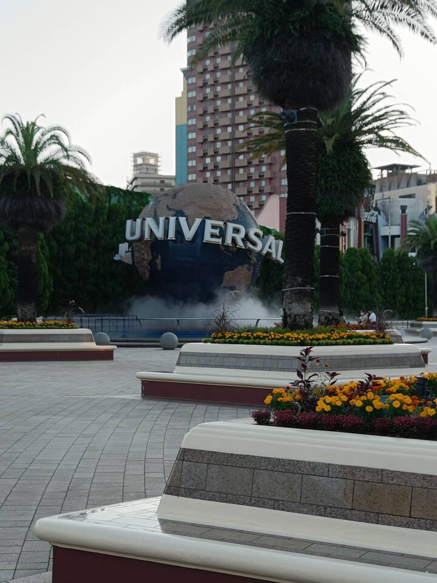
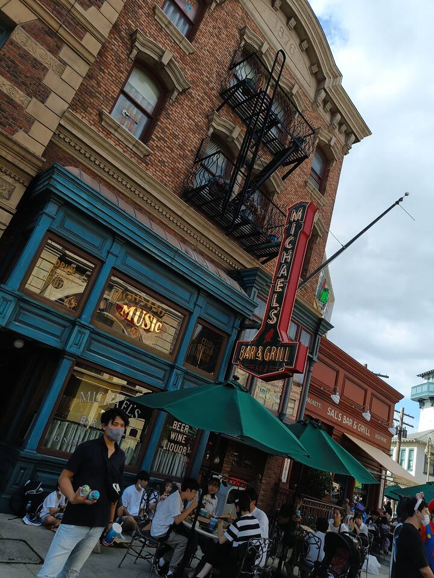
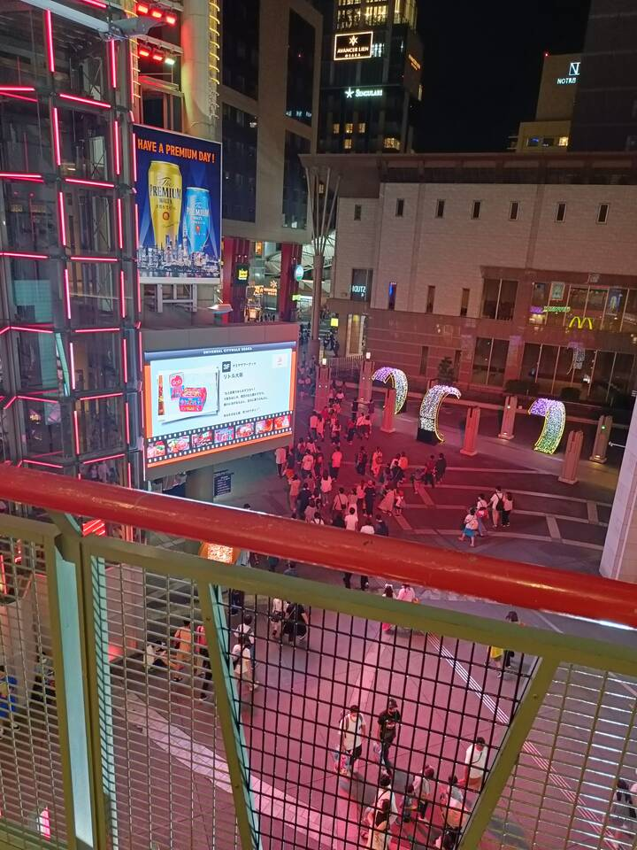

---
title:
    Universal Studios Japan
---

We visited Universal Studios Japan this weekend. USJ is a theme park in
Oosaka with lots of different attractions related to Universal Studio shows and
characters. It was a fun but also really exhausting trip as we went by night
bus.

## Arrival

We departed at around 23:00 with a group of 16 people. Our first destination was
Nagakute Kosenjou station which we reached after a 20 minute walk. We then took
a train to Fujigaoka station and rode the Higashiyama line to Nagoya station.
Usually, we take a Meitetsu bus to Fujigaoka or a school bus to Kamiyashiro,
but in our case we were too many people and it was late already so buses were
running infrequent. After arriving at Nagoya station at around 23:50, we went
to the bus stop and successfully boarded the bus.

The bus ride itself was really uncomfortable as the seats were too small for
me, so I could only get like an hour of sleep in. We had a half hour break at
2:30am and continued at 4:00 cause the bus driver had to sleep too. We went
through Oosaka though so we at least had a nice urban scenery to gaze at. Final
arrival was at 6:30 and everyone was really exhausted, but the day had only
just begun.

<figure>
<figcaption>Nagakute Kosenjou station</figcaption></figure>
<figure>
<figcaption>JR central towers at Nagoya station</figcaption></figure>
<figure>
<figcaption>Night bus to Oosaka</figcaption></figure>
<figure>
<figcaption>My legs were actually ok, only my neck hurt</figcaption></figure>
<figure>
<figcaption>Generous break at a service area (サービスエレア)</figcaption></figure>
<figure>
<figcaption>Dinner 👍</figcaption></figure>
<figure>
<figcaption>I'm still not used to that much infrastructure</figcaption></figure>
<figure>
<figcaption>Right through the center</figcaption></figure>

## USJ

I've never really been to a theme park before so this experience was the first
for me. The park was still closed after we arrived so we had to wait around
thirty minutes at the gate plaza. Even though the park didn't open yet, lots of
people were already taking pictures of the huge-ass universal globe. Film music
was blaring constantly, of which I sadly couldn't recognize a single piece. Even
though there were hundreds of people and only like 10 gates, it took only a few
minutes to enter the park once it opened and because it was enormous, the large
crowd disbanded pretty quickly and it became easy to walk around.

<figure>
<figcaption>We arrived early so there weren't many people around</figcaption></figure>
<figure>
<figcaption>After the park opened, lots of cosplayers took pictures there</figcaption></figure>
<figure>
<figcaption>Enough room for lots of people</figcaption></figure>
<figure>
<figcaption>Entry to our first stop</figcaption></figure>

### Super Nintendo World

Our first stop was Super Nintendo World. After passing through a pipe, we
reached an elevated platform from which you could see an incredible real-life
replica of a Mario level. We also rode the Yoshi express which had buttons in
the front you could press to create incredibly annoying sounds.

 <figure> <figcaption>Yoshi World with lots of obnoxious
music</figcaption></figure> <figure><iframe style="height: 650px;"
src="https://www.youtube.com/embed/inLUaoLU6Bc" title="YouTube video player"
frameborder="0" allow="accelerometer; autoplay; clipboard-write;
encrypted-media; gyroscope; picture-in-picture"
allowfullscreen></iframe></figure> 

### Harry Potter

After wandering around for a while and getting something to drink, we headed
towards the Harry Potter/Hogwarts section. We went through a small strip of
forest with speakers howling like wolves and imitating owls everywhere.
Reaching the end of the forest path, we could see a huge castle which was a
replica of Hogwarts as well as the small town near it. I'm not a big Harry
Potter fan, but the atmosphere was just incredible and it all felt very real.
There were also lots of stores you could actually visit that sold for example
butter beer or weird prank articles, but the lines were very long already so we
were content with just watching.

<figure>
<figcaption>I don't know how this town is called</figcaption></figure>
<figure>
<figcaption>You could even go inside</figcaption></figure>
<figure>
<figcaption>The rollercoaster is really small, but high speed</figcaption></figure>
<figure><iframe style="height: 700px;" src="https://www.youtube.com/embed/qmeXbG775Mc" title="YouTube video player"
frameborder="0" allow="accelerometer; autoplay; clipboard-write; encrypted-media;
gyroscope; picture-in-picture" allowfullscreen></iframe></figure>

They had another ride which was called "Harry Potter and the Forbidden Journey"
where you ride on a rollercoaster-like track, turn around a lot and lose
orientation. It uses lots special effects like fog and giant screens which
simulate things like playing quidditch and fighting death eaters. I obviously
couldn't take a video so [here's](https://www.youtube.com/watch?v=eVtnB_hEIOQ)
one if you're interested cause the ride was really fun.

### Other stuff

There were loads of things to explore which I can't present all. Some honorable
mentions include Jurassic World which had a giant in-door rollercoaster with
water, a Resident Evil escaperoom with loud noises and zombies chasing you and
minion land which had, who could've guessed, minions. We didn't visit
everything though so there's quite a lot of stuff I can't talk about like the
Jaws or Terminator section. Generally, there were also lots of stores and food
stalls not belonging to any particular movie franchise and lots of people were
wearing non-USJ-related costumes.

<figure>
<figcaption>Indoor rollercoaster</figcaption></figure>
<figure>
<figcaption>The big one was closed unfortunately</figcaption></figure>
<figure>
<figcaption>I don't know why, but minions are really popular in Japan</figcaption></figure>
<figure>
<figcaption>"Fun store"</figcaption></figure>
<figure>
<figcaption>Resident evil escape room</figcaption></figure>
<figure>
<figcaption>All of the stores had a really nice atmosphere</figcaption></figure>

There was also a special Jujutsu Kaisen screening for which we stood in line
for over an hour. It was one of those *4D*-cinemas where the seat moves and you
get sprayed with water. Afterwards, we went to a merch store and I bought a JJK
mug. I have no idea though how I'm supposed to bring everything back. Well,
that's a problem for future me. Oh, and we also met a random group of people
with which we had a bottle flip standoff. They won.

### Evening

Later in the evening the atmosphere completely changed. After 18:00, zombies,
skeletons, clowns and other halloween-related monsters came out and roamed the
streets. Some of them had chainsaw-like tools and pretended to cut people's
legs off. Others were just pumping bass and dancing like crazy. It was really
fun to look at.

<iframe width="600" height="800"
src="https://www.youtube.com/embed/CxXNpZEvVRo" title="YouTube video player"
frameborder="0" allow="accelerometer; autoplay; clipboard-write;
encrypted-media; gyroscope; picture-in-picure" allowfullscreen></iframe>

After a while, we all got hungry and decided to leave at around 21:00 to get
some food. There was a shopping district nearby so we went there and had dinner.

<figure>
<figcaption>Leaving USJ</figcaption></figure>
<figure>
<figcaption>Shopping district</figcaption></figure>
<figure>
<figcaption>It had quite a nice vibe to it</figcaption></figure>
<figure>
<figcaption>Dinner 👍</figcaption></figure>

## Departure

The way back went pretty much the same as our arrival. We got into the bus at
around midnight and arrived completely exhausted at Nagoya in the morning.
After taking the metro lines and walking back to the dorm, we all went to sleep
and got to enjoy the rest of the sunday. It was a nice trip overall, but next
time I'd take the train and pay the extra money as the bus was really
uncomfortable for me.
