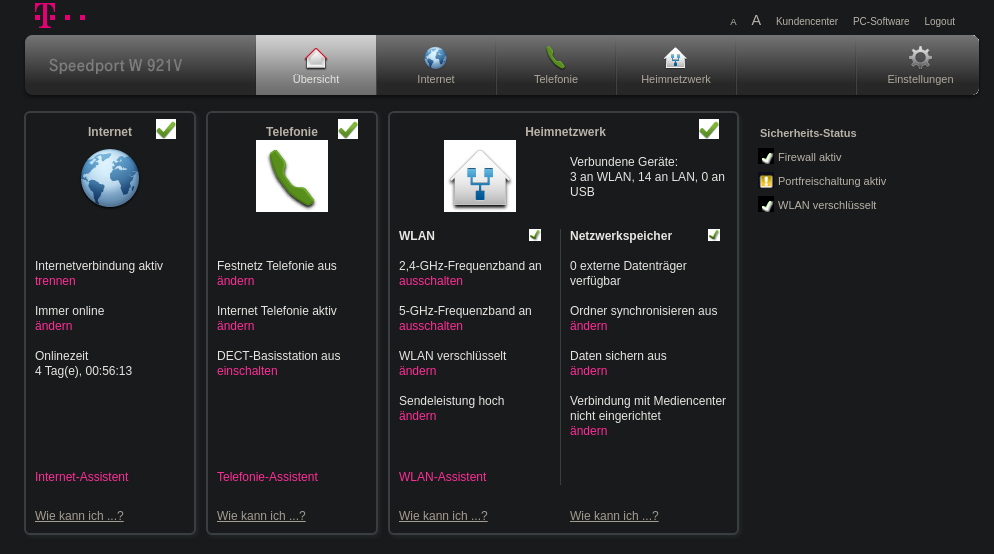
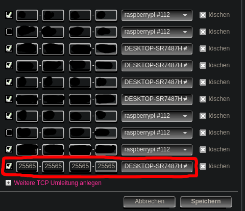
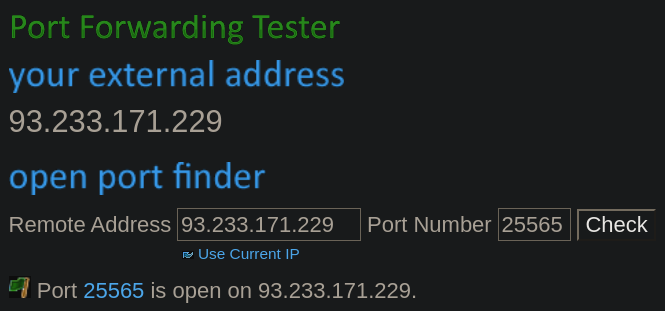

---
title:
    How to set up a dedicated Minecraft server
---

[Minecraft](https://www.minecraft.net/en-us) is a game I've been playing a lot
since my childhood, either in singleplayer or sometimes in multiplayer too.
Lots of people wanting to play multiplayer often rent a server or install
insecure and useless VPN applications like Hamachi. Renting a server is
probably the best option if you have lots of players playing at different
times, but can get expensive too.  If you just want to play together with
friends, you can set up your own dedicated server quite easily.

## Getting the files

First, you need to download a server jar. You can
use[this](https://mcversions.net/) site to choose your version (you probably
want the latest stable release, in my case 1.16.5), but make sure you download
the server and not the client jar. Once you have those, create a server folder
somewhere and put it there. I will use `./server/` as an example directory.

## Startup script

Next, you want to create a startup script. The server needs to be run using
java and you need to pass multiple options to set things like the amount of
RAM. This script allows you to simply click on it to start your server.

(Windows users should choose a file name ending with `.bat` and macOS/Linux
users one ending with `.sh`, but the script should work the same for both)

```sh
java -Xmx2048M -Xms 2048M -jar server.jar nogui
```

- -Xmx and -Xms set the maximum/initial amount of RAM. For 4GiB, you would want
4096M
- -jar server.jar tells java which jar to run. If your server.jar has a
different name, you'd change it here
- nogui disables the server gui and uses the console/terminal only

## Initial configuration

Run the script once to create the initial files. You first need to change
`eula=false` to `eula=true` inside of `eula.txt`. You can then proceed to edit
the `server.properties` file which contains all of the server settings. You
should change world generation settings like `allow-nether` or
`generate-structures` to configure the world to your liking. I also recommend
to set `spawn-protection` to 0 and `white-list` as well as `enforce-whitelist`
to true. You should also add yourself to the whitelist using the `whitelist add
<name>` command in your server console.  You can then rerun your startup script
to finish the world generation and initial server startup.

To test out whether your server works, start minecraft and connect to
localhost:25565.  You can change the port to be something else than 25565, but
we will leave it for the time being. If you land in a new world and the server
shows a player with your name connected, the server is working properly.

## Port forwarding

The last part you need to take care of if you want others to be able to join
your server is opening your server port. This is done via your router's web
interface which differs for each one. I will use mine as an example.

You first need the local IP address of your router. For Windows 10, you can
open a console window, enter `ipconfig` and find the value next to `default
gateway`.  For Linux you probably already know how to do it, but in case you
don't, enter `ip route` in your terminal of choice. Your router's IP address is
next to `default via`.

Enter this into your web browser and log in to your router using it's password.
It can usually be found physically on the back of your router.



Then go to Internet -> Portfreischaltung (port redirection) and add a new TCP
entry.  You need to redirect the port in your `server.properties` file (default
25565) to your current computer. If you don't know which one is your computer,
manually check its name or its IP.



People from outside should now have access to your server. You can check
yourself using [this](https://www.yougetsignal.com/tools/open-ports/) website.
Enter your port in the port number field, click on check and it should show
that the port is open.  You can also give the remote address to your friends
since this is the one they will be connecting with. If you just want your
public IP address, you can use [ifconfig.me](https://ifconfig.me).



People should now be able to connect to your server. Your public IP might
change from time to time, so if there are any connection problems recheck your
IP address and give out the new one. You can also use a dynamic IP service such
as [noip](https://www.noip.com/) for a free dynamic DNS.
