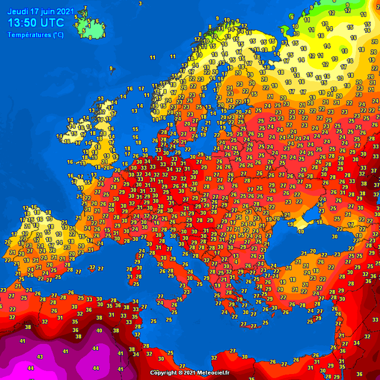

---
title:
    It's Summer
---

The northern hemisphere is experiencing its first heat wave this year with
temperatures of some north-western parts of Germany reaching as high as 35°C.

## The first day

It has begun. Spring is over, the days are getting longer and the temperature
is reaching over 30°C already. My summer experience can be pretty much summed
up by the things I experienced yesterday.

I went to sleep quite early at 10pm cause I had to get up early for university.
I fell asleep quickly as I was tired, but already woke up at 3am disturbed by a
wave of heat radiating from the ceiling. We renewed our roof isolation recently
so all of the heat trapped there during the day is keeping my room from cooling
down even at night.

Trying to fall back asleep for over an hour, I finally gave up and decided to
just stay awake and do something productive. I worked on some assignments till
5am and then went outside for a quick run. Even though it was already bright
outside, the sun did not yet directly hit me so the temperature was bearable.
But as soon as I finished the first part of my planned route, this changed
suddenly as the sun climbed over the horizon and started cooking me. It only
took 15 more minutes to get home so that wasn't too bad.

After taking a shower and shutting down every window, I did some more work and
played video games for around 3 hours. We bought a new portable AC unit which
is supposed to cool the entire room just using water so I turned it on,
doubting its effectiveness. At first, it seemed like it was working because the
temperature actually dropped, but it was an hour later when I left my room when
I noticed how disgusting the climate actually was. The temperature sensor of my
room showed 29°C, but the humidity was at 80%. Wtf. I promptly turned off the
AC and now use it only as a giant, expensive fan.

It is 1pm now and I drove to the nearby grocery store to get some essentials.
To prevent the car from becoming a literal oven, I parked next to a sign
blocking the sun. This actually worked, but I needed to walk like 100 meters to
get to the store which already was too much.

Every move I thereon made was carefully designed to conserve as much energy as
possible. I did not want to move a single muscle or burn a single molecule of
ATP unless absolutely necessary. This meant lying in bed completely motionless
and just consooming media on TV.

We have over 100sqm of lawn with corners and trees in the way which need to be
mowed every week. It usually only needs to be done once before summer as the
grass just dies due to the heat, but we still haven't done it, so there's that.

## What I like

There are some things about summer I really like, the most important one being
that it's already bright and warm early in the morning and you can go outside
just wearing a shirt. Eating ice cream, organizing a BBQ or going to the public
pool is very refreshing and birds waking you up in the morning together with
green nature makes for a great ambient.

## What I don't like

Summer is hot. Like, really hot. Maybe I just can't deal with heat, but I hate
it.  The thing in Germany is that people generally don't have AC so if you are
one of the few unfortunate ones to live in a room that tends to heat up very
much, too bad.  When it's cold it's easy to just put on more clothing or use
heating to keep yourself warm, but there's not much you can do to keep yourself
cold except maybe excessively drinking refrigerated water.

It's hard for me to sleep when it's 30°C during the night and opening the
windows doesn't help much. Having a computer run only worsens the situation
because hot air is constantly being blown into my face. My hands sweat a lot
when using the keyboard and mouse which is really disgusting. Sweating is fine
when doing sports and you can shower afterwards, but constantly being wet even
when showering twice a day or driving with your back sticking to the seat is
the most uncomfortable season-induced feeling.

Every negative point I make about summer outweights even the most positive one.
I hope I can stay inside as much as possible this year which seems very
promising due to the still ongoing pandemic and online lectures.

There are also many other points that don't affect me directly like water
shortages in certain regions just yet, but the future will probably make things
worse. This is a problem for lots of other areas too of course, so I can
probably count myself as one of the lucky ones (poor Arizona!).

To summarize: **fuck summer**.
