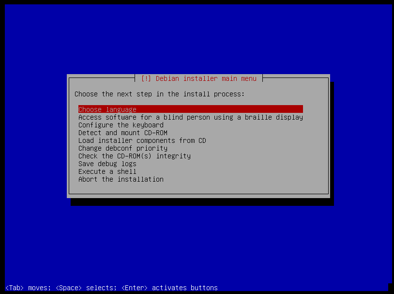
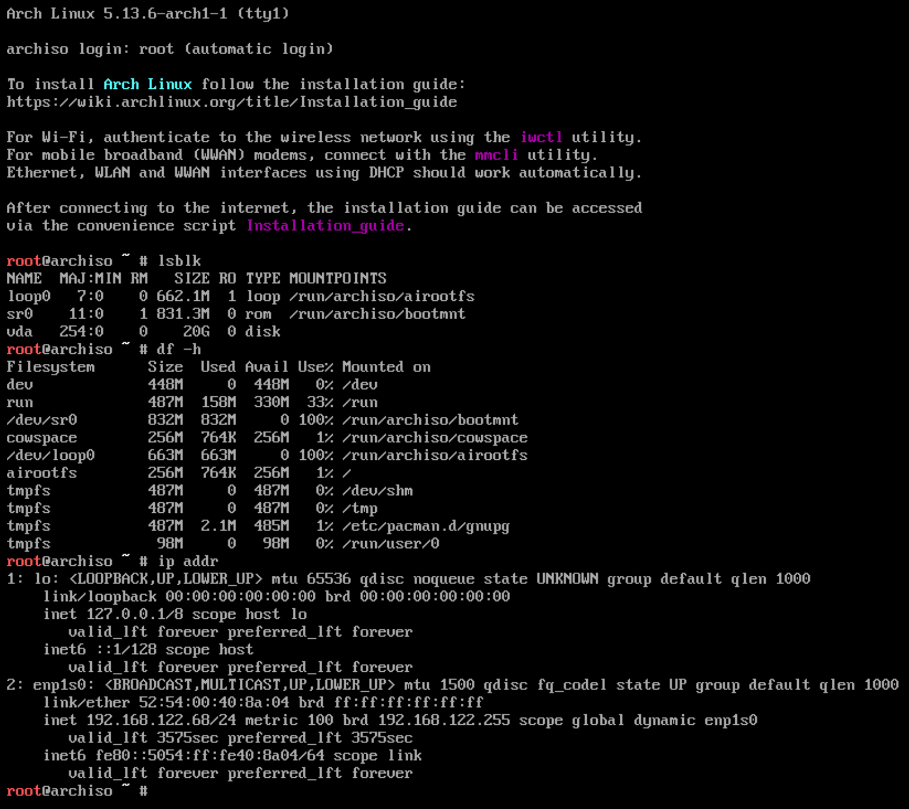

---
title:
    An introduction to Linux
---

You have probably heard of this thing called *Linux* and you might also know that
I use it. Now be honest, how many other people do you know that use it? One? Zero?
I'm sure it's a pretty low number. Hell, even I know only a few people in real
life that use some kind of Linux despite studying CS (which is something I will
come back to later). Okay, nobody uses it, so why should I care?

First and foremost, this is **wrong**. You might not actually know someone using
Linux as a desktop operating system, but I bet you know people using it on their
mobile phones. If your friends are not part of the Apple zombie crowd, they probably
use Android which is actually based on a modified version of the Linux kernel! It
doesn't stop with phones though as [100% of the TOP500](https://www.top500.org/statistics/details/osfam/1/)
supercomputers run on Linux as well. Linux also dominates the web infrastructure
with more than 95% of servers running the top 1 million domains also being powered
by Linux. If you want more statistics, take a look at [this](https://hostingtribunal.com/blog/linux-statistics/)
website or do a quick Google search.

So it's actually the other way around with devices powered by Linux outnumbering
every other OS. If you are a technically inclined person, which I assume you are, you
should therefore know at least the barebones of what Linux is and where it came from.
I am by no means a historian, but I hope this quick rundown will give you an
overview without going too much into depth.

- 1969: [Ken Thompson](https://en.wikipedia.org/wiki/Ken_Thompson) and [Dennis Ritchie](https://en.wikipedia.org/wiki/Dennis_Ritchie)
develop the first Unix operating system at Bell Labs, inspired by its predecessor Multics
- 1980: most software at this time is being released under proprietary licenses,
meaning users could not simply study and modify the source code
- 1983: [Richard Stallman](https://stallman.org/) starts the
[GNU project](https://www.gnu.org/home.en.html) to create a UNIX-like and free operating
system, developing enough software for a usable OS, but with a missing kernel
- 1985: Intel releases the 80386 (i386) microprocessor, the first one using a 32-bit
instruction set and a MMU with paging instead of segmentation
- 1987: [Tanenbaum](https://en.wikipedia.org/wiki/Andrew_S._Tanenbaum) releases [MINIX](https://www.minix3.org/), a Unix-like OS intended
for academic purposes which was not well adapted to the features of the i386
- 1991: Linus Torvalds begins work on his project due to the lack of a widely
adopted and free kernel, inspired by Minix

While the GNU project was developing the GNU Hurd kernel, it was far from done
and its development is still stagnating to this day. Because Linux came
available as a viable solution, they chose it instead, creating the first
GNU/Linux free operating system. If you want to really bring a free software
evangelist to a boil, ask them if they use *Linux*. They will probably shout back
that it's called *GNU slash Linux* or *GNU plus Linux* because "*Linux is just
the kernel*". Although they are technically correct, I also just call it Linux, so
whatever, do as you please :).

If you want more information, I highly recommend Torvald's autobiography
[Just for Fun: The Story of an Accidental Revolution](https://www.amazon.de/Just-Fun-Story-Accidental-Revolutionary/dp/0066620732)
in which he does not only talk about Linux from a technical point of view, but also
how he himself developed and came to start such an enormous project and which
role the Open Source model played.

We now saw that Linux is part of the GNU project which in turn was developed as
a free replacement for the proprietary Unix operating system. This essentially
means that

1. Linux is [free (TODO)](./todo.html), and
2. Linux is [Unix-like (TODO)](./todo.html)

Now to get some distance to all the theoretical background, let's take a look at
a few practical, modern examples. We'll start with Linux as a desktop operating
system.

<figure style="display: inline-block; width: 500px; text-align: center;">

<figcaption>Debian Installation</figcaption>
</figure>
<figure style="display: inline-block; width: 500px; text-align: center;">

<figcaption>Arch Installation</figcaption>
</figure>

These two look very different, don't they? This is because although they use Linux
as a base, the software they run (including the graphical programs) can vary widely.
The important point to take away is that Linux doesn't ship any user software
per default. Because such a system would be unusuable, Linux is often bundled with
other software such as the [GNU coreutils](https://www.gnu.org/software/coreutils/)
for basic file and text manipulation or [X11](https://www.x.org/wiki/) for a
graphical environment. Such a bundle is called a distribution, or *distro* for short.
There are hundreds of distros out there, most of them catering only to a small user base.
Having such a wide range of options means there is a distro perfectly suited for
almost any purpose imaginable. The choice often boils down to personal preference,
especially in the desktop market, but can also be influenced by certain restrictions.
Popular distros for desktop usage include [Ubuntu](https://ubuntu.com/),
[Linux Mint](https://linuxmint.com/) or [Manjaro](https://manjaro.org/).

If you are running some servers in a data center, you usually don't need a graphical
environment or office programs. This is why you'd probably choose a distro without
any graphical environment to save resources and reduce dependencies. A common server
distro is [Debian](https://www.debian.org/) which itself is usable with or without graphics.
If you were to work with embedded devices, you might not even use any interactive tools at all!

This is one of the things that sets Linux apart from other software like Windows
or macOS. While they make choices for you (be it good or bad) and supply a
predesigned system, Linux gives you freedom of choice to design your own system
tailored to a specific use case.

This was only an introduction as it would probably take more than a lifetime
to explain everything properly. Below I have linked some more articles going
into depth about Linux-related concepts which you might find interesting.

- [Files in Linux](./files_in_linux.html)
- [(TODO)](./todo.html)
- [(TODO)](./todo.html)
