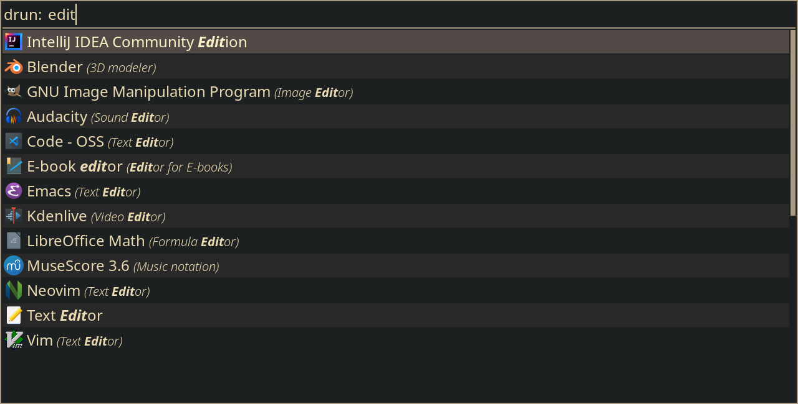

---
title:
    Everything wrong with Windows Explorer
---

Windows Explorer - the file explorer of choice since Windows 95. Its job seems
simple; present the file system through a nice interface and allow the user to
create or edit files and directories. In reality, it does way more than that,
creating completely unnecessary dependencies and making the whole system
unstable.

The thing annoying me the most is the explorer serving as an application
launcher. An application launcher should do nothing more than read a query
through a text field and presenting a list of matching applications from which
the user can choose.

[Rofi](https://github.com/davatorium/rofi) is a great example. It takes a
single query as input and matches application names as well as categories. It
is simple, fast and reliable. Windows on the other hand tries to achieve
similar functionality through the search bar which you can access by pressing
the Super key. So what happens when the Windows Explorer crashes or hangs
(which happens like 3 times a week for me)? Correct, you just lost the ability
to launch applications! How unfortunate. But I can just click the icons on the
desktop or on the task bar, right? Nah, you can't. Windows Explorer handles
these as well.

So a single, regularly occuring bug makes the whole system unusable. What can I
do? You have to restart the system of course. Okay, time to press Super and
choose poweroff. Oh, you can't open the menu because it's handled by the
Explorer? Too bad. Well, I can still press Alt-F4 while on the desktop to
directly open the menu. No menu appears? Your loss. The only option left now is
to force a poweroff by holding down the power button.

Just managing to restart your PC doesn't guarantee to fix the issue though. I
couldn't use my Windows installation today because even a hard restart didn't
fix the problem.

<iframe style="display: block; margin: 0 auto" width="800" height="450"
src="https://www.youtube.com/embed/yYVbaNF0x6E" title="Explorer restart loop"
frameborder="0" allow="accelerometer; autoplay; clipboard-write;
encrypted-media; gyroscope; picture-in-picture" allowfullscreen></iframe>

And don't get me started on the Explorers (in)ability to find programs or
documents. I've had plenty of situations where searching for a file by its
name, excluding the last letter, gave a result, while searching by its full
name gave no result at all. The web results are completely unnecessary as well;
if I wanted to search the web, I'd just open a browser (the results would be
10x better as well).

The only positive thing I can say about the Explorer is that it finally got a
dark theme a few years ago. That's way too late and you have to rummate through
the chaotic settings menu, but better late than never, huh.

If you ignore all the shortcomings and only view the Explorer as a file
explorer, you can barely call it mediocre. Its interface is completely
cluttered and packed to the brim with unnecessary buttons. You can remove the
whole top part and still have the same functionality while making more room for
the things that really matter like actually showing files and folders. It
doesn't even support tabs, like wtf? Every time you need to view two or more
folders at once you need to open a whole new explorer instance. And if
Microsoft trashes the performance of such an essential program anyway, they
might as well add a nice preview feature so it can shine at least through its
appearance. They should also add more icons for different filetypes, but I
doubt they'll fix their mess anytime soon.

It's completely incomprehensible to me how you can base so much of your systems
usability on such a shitty piece of software.
